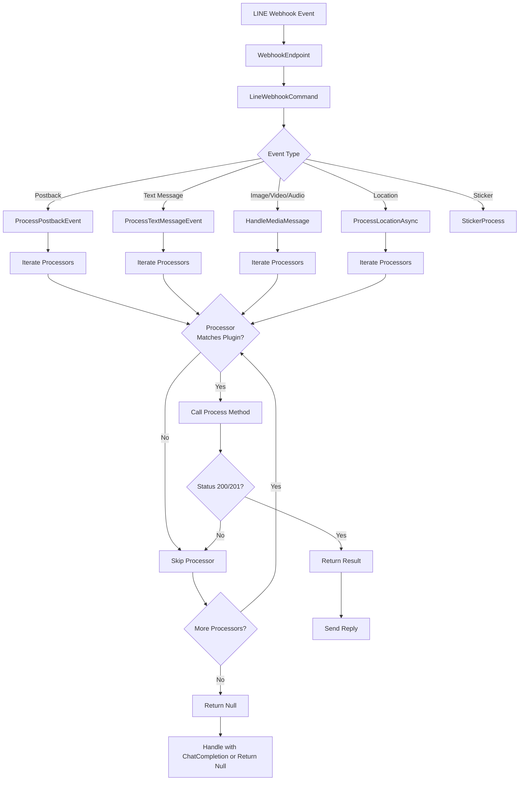

# LINE Chatbot Architecture

## Overview
This document describes the architecture of the LINE chatbot system, focusing on how events are processed and how the cancellation mechanism works.

## System Components

### 1. Webhook Endpoint
The entry point for all LINE events is the webhook endpoint:
- `src/Web/Endpoints/WebhookEndpoint.cs` - Handles incoming HTTP requests from LINE

### 2. LineWebhookCommand
The core command that processes all LINE events:
- `src/Application/Webhook/Commands/LineWebhookCommand/LineWebhookCommand.cs`
- Responsible for routing events to appropriate processors
- Handles different event types: postback, message (text, image, location, etc.)

### 3. Processors
Individual components that handle specific functionality:
- Implement `ILineMessageProcessor` interface
- Each processor has a unique name defined in `src/Domain/Constants/Systems.cs`
- Registered automatically through dependency injection in `src/Infrastructure/DependencyInjection.cs`

### 4. Cancellation Handler
Interface for processors that maintain session state:
- `src/Application/Common/Interfaces/IProcessorCancellationHandler.cs`
- Currently implemented by `LLamaPassportProcessor` and potentially others

## Event Flow



## Processor Registration

Processors are automatically registered through dependency injection:

```csharp
// In src/Infrastructure/DependencyInjection.cs
var processorTypes = typeof(DependencyInjection).Assembly.GetTypes()
    .Where(t => t.IsClass && !t.IsAbstract && typeof(ILineMessageProcessor).IsAssignableFrom(t));

foreach (var type in processorTypes)
{
    services.AddScoped(typeof(ILineMessageProcessor), type);
}
```

## Current Cancellation Implementation

Currently, only the `LLamaPassportProcessor` implements the `IProcessorCancellationHandler` interface:

```csharp
public class LLamaPassportProcessor : ILineMessageProcessor, IProcessorCancellationHandler
{
    public async Task CancelOperationsAsync(string userId, CancellationToken cancellationToken = default)
    {
        try
        {
            // Remove passport result from cache
            await _cache.RemoveAsync($"passport_result:{userId}", cancellationToken);
            
            // Remove passport state from cache
            await _cache.RemoveAsync($"passport_state:{userId}", cancellationToken);
            
            _logger.LogInformation("Cancelled LLamaPassport operations for user {UserId}", userId);
        }
        catch (Exception ex)
        {
            _logger.LogError(ex, "Error cancelling LLamaPassport operations for user {UserId}", userId);
        }
    }
}
```

## WorkingTimeProcessor Cancellation Pattern

Although the `WorkingTimeProcessor` doesn't implement `IProcessorCancellationHandler`, it has a similar pattern:

```csharp
private async Task CancelPreviousOperations(string userId, CancellationToken cancellationToken)
{
    try
    {
        // Cancel working time session if exists
        await _cache.RemoveAsync($"workingtime_session:{userId}", cancellationToken);
        
        // Cancel registration flow if exists (from EmailRegistrationProcessor)
        await _cache.RemoveAsync($"registration_flow_{userId}", cancellationToken);
        
        _logger.LogInformation("Cancelled previous operations for user {UserId}", userId);
    }
    catch (Exception ex)
    {
        _logger.LogError(ex, "Error cancelling previous operations for user {UserId}", userId);
    }
}
```

## Proposed Cancellation Mechanism

To implement the feature where selecting a new menu should cancel previous operations, we need to:

1. Modify `LineWebhookCommand` to detect menu selections
2. Add cancellation calls before processing new menu selections
3. Ensure all processors that maintain session state implement `IProcessorCancellationHandler`